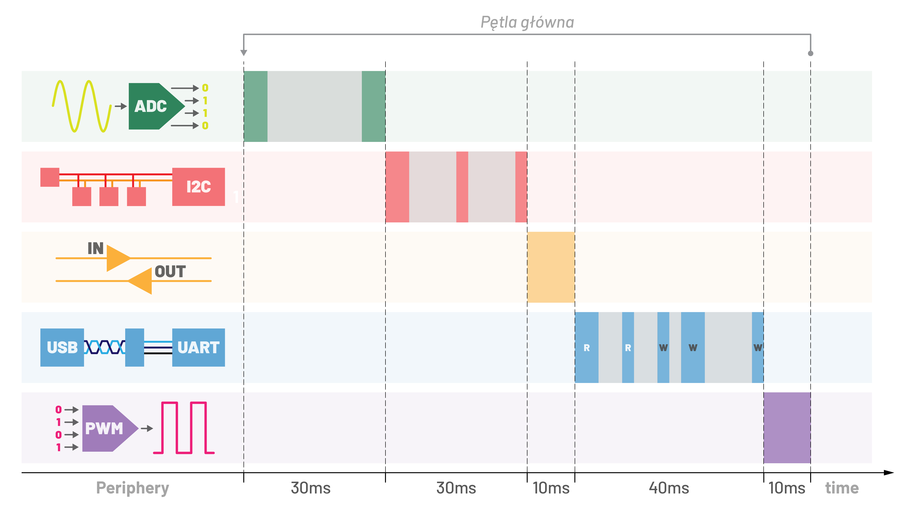
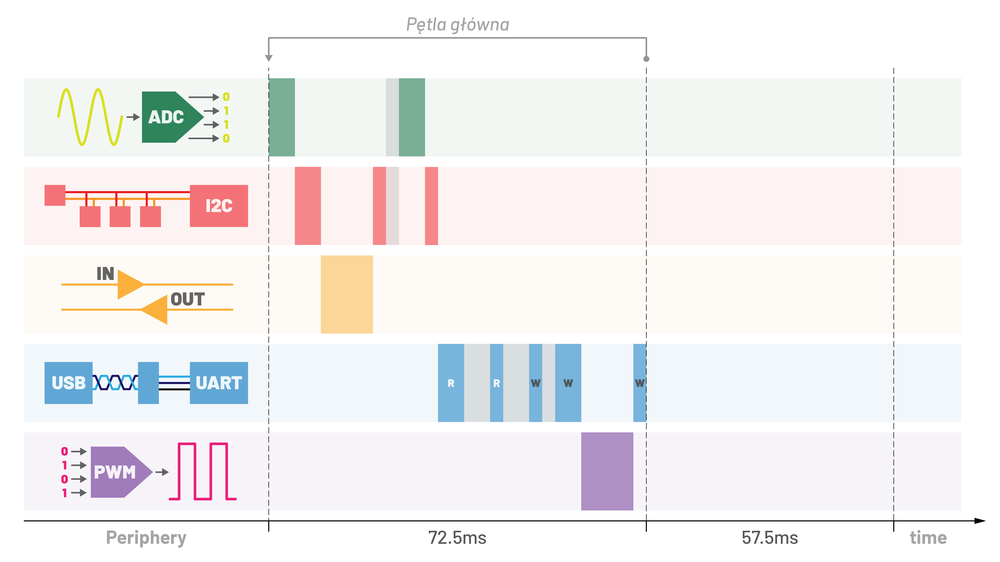
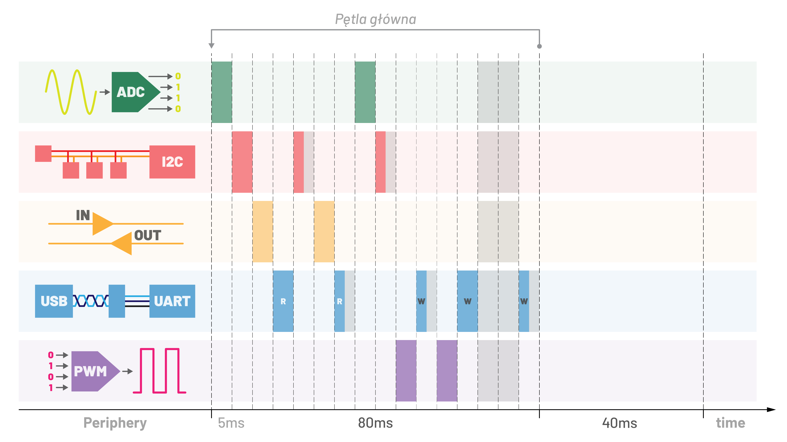
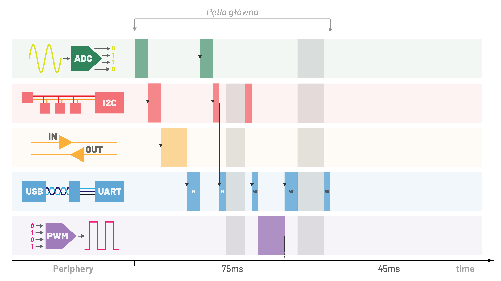
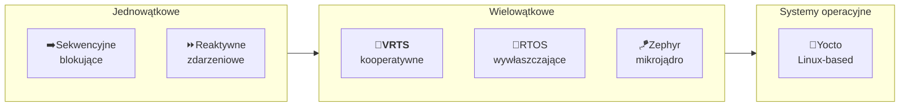

**VRTS** _(Voluntary Release Threads System)_ to lekka biblioteka kooperatywnej wielowątkowości dla STM32 _(CM0+, CM4F)_ i symulacji desktopowej _(Linux, Windows)_. W przeciwieństwie do RTOS, wątki nigdy nie są przerywane, każdy sam decyduje kiedy oddać rdzeń. Kod jest prostszy do analizy, a tworzenie i testowanie w jednym wątku, a następnie przejście do wielowątkowego, wymaga minimalnych zmian.

## 💡 Koncepcja

Aplikacje embedded muszą obsługiwać wiele zadań jednocześnie: odczyt czujników, komunikację, sterowanie wyjściami. Sposób w jaki to zorganizujesz ma duży wpływ na złożoność i zużycie zasobów.

**Jednowątkowe**

- ➡️**Sekwencyjne**: blokuje na każdej operacji. Proste, ale CPU czeka bezczynnie na ADC, UART, timery.
- ⏩**Reaktywne** (zdarzeniowe): przerwania i callbacki trzymają CPU zajętym, ale logika rozprasza się po handlerach. Biblioteki stają się silnie powiązane z aplikacją.

**Wielowątkowe**

- 🔀**VRTS**: wątki dobrowolnie oddają rdzeń. Brak wywłaszczania, przewidywalne wykonanie, minimalny narzut. Twórz i testuj każdy wątek osobno, potem go zarejestruj.
- 🔁**RTOS** _(FreeRTOS)_: wywłaszczający, stałe kwanty czasu. Potężny, ale wymaga mutexów i ostrożnej obsługi współdzielonej pamięci.
- 🪁**Zephyr**: pełny mikrojądro RTOS z warstwą abstrakcji sprzętu. Skaluje się do złożonych systemów, znacznie większy footprint.

**Systemy operacyjne**

- 🐧**Yocto**: oparty na Linuksie, pełny stos OS. Wymaga MMU, rzędy wielkości więcej zasobów. Dla procesorów aplikacyjnych, nie mikrokontrolerów.

<table>
  <tr>
    <td width="50%"></td>
    <td width="50%"></td>
  </tr>
  <tr>
    <td width="50%" align="center">Sekwencyjne</td>
    <td width="50%" align="center">Reaktywne</td>
  </tr>
  <tr>
    <td width="50%"></td>
    <td width="50%"></td>
  </tr>
  <tr>
    <td width="50%" align="center">RTOS</td>
    <td width="50%" align="center"><b>VRTS</b></td>
  </tr>
</table>



## 🆚 Porównanie

Subiektywne porównanie podejść do programowania embedded.

| Metryka | Sekwencyjne | Reaktywne | VRTS | RTOS | 🪁 Zephyr | 🐧 Yocto |
| :--- | :---: | :---: | :---: | :---: | :---: | :---: |
| Zużycie RAM i Flash | 🟢🟢🟢 | 🟢🟢🟢 | 🟢🟢 | 🟡🟡 | 🟡 | 🔴 |
| Skalowalność | 🔴 | 🟡 | 🟡🟡 | 🟢🟢 | 🟢🟢🟢 | 🟢🟢🟢 |
| Łatwość użycia | 🟢🟢🟢 | 🟡🟡 | 🟢🟢 | 🟡 | 🟡 | 🔴 |
| Czytelność kodu | 🟢🟢🟢 | 🟡 | 🟢🟢🟢 | 🟡🟡 | 🟢🟢 | 🟡🟡 |
| Brak synchronizacji | 🟢🟢🟢 | 🟢🟢🟢 | 🟢🟢 | 🟡 | 🟡 | 🟡 |
| Ekosystem i społeczność | 🟡 | 🟢🟢 | 🔴 | 🟢🟢🟢 | 🟢🟢 | 🟢🟢🟢 |

## 🚀 Pierwsze kroki

Wszystkie funkcje czasowe opierają się na bazowym ticku `systick_init`. Przełączanie wątków i śledzenie czasu są ściśle zintegrowane: `delay`, `timeout` i `tick_*` współpracują z `let` pod spodem.

### Konfiguracja

```c
// main.h: nadpisz domyślne wartości jeśli potrzeba
#define VRTS_THREAD_LIMIT 5
#define VRTS_SWITCHING 1
```

```c
#include "vrts.h"

stack(main_stack, 256);
stack(temp_stack, 128);
stack(adc_stack,  128);

int main(void)
{
  systick_init(10); // bazowy tick 10ms
  thread(Main_Thread, main_stack);
  thread(Temp_Thread, temp_stack);
  thread(Adc_Thread,  adc_stack);
  vrts_init(); // nie wraca
}
```

### `let`

Oddaje rdzeń następnemu wątkowi. Wywołuj zawsze gdy wątek nie ma nic pilnego do zrobienia.

```c
void UART_Thread(void)
{
  while(1) {
    size_t len = UART_Read(&msg);
    if(len) {
      // obsługa wiadomości
    }
    let(); // przekaż rdzeń
  }
}
```

### `delay` / `sleep`

Obie czekają określony czas. `delay` oddaje rdzeń innym wątkom podczas oczekiwania. `sleep` blokuje: nie ma przełączania.

```c
GPIO_Set(&gpio);
delay(1000); // 1s: inne wątki działają
GPIO_Rst(&gpio);
```

```c
GPIO_Set(&gpio);
sleep(200); // 200ms: rdzeń zablokowany w tym wątku
GPIO_Rst(&gpio);
```

### `timeout`

Czeka na warunek z limitem czasu. Wymaga callbacka zwracającego `true` gdy warunek jest spełniony. Zwraca `true` przy przekroczeniu czasu.

```c
ADC_Start(&adc);
if(timeout(50, WAIT_&ADC_IsFree, &adc)) {
  // błąd: pomiar trwał za długo
}
else {
  uint16_t value = ADC_Get(&adc, 3); // kanał 3
}
```

### `tick_keep` + `tick_over`

Zaplanuj zadanie jednorazowe między wątkami. `tick_keep` ustawia deadline, `tick_over` odpala raz gdy minie i resetuje.

```c
uint64_t deadline;

void Thread_1(void)
{
  if(!deadline) deadline = tick_keep(500); // za 500ms
  let();
}

void Thread_2(void)
{
  if(tick_over(&deadline)) {
    // odpala raz, 500ms po ustawieniu przez Thread_1
  }
  let();
}
```

### `tick_keep` + `tick_away`

Odpytuj deadline ciągle. `tick_away` zwraca `true` podczas oczekiwania, `false` gdy minie: i resetuje.

```c
uint64_t deadline = tick_keep(1000);

while(tick_away(&deadline)) {
  // rób coś dopóki jest czas
  let();
}
// czas minął
```

### `tick_diff`

Mierzy czas od referencyjnego ticka.

```c
void Thread(void)
{
  uint64_t ref = tick_keep(0); // zapisz teraz
  // ... obliczenia ...
  int32_t elapsed_ms = tick_diff(ref);
}
```

### Przykład

Trzy [**diody migają**](example.c) niezależnie, każda w swoim wątku.

## 📚 Sterta

VRTS zawiera deterministyczny alokator pamięci i garbage collector per-wątek: zamiennik dla `malloc`/`free` bez narzutu stdlib. Dzięki kooperatywności VRTS jedna wspólna sterta jest bezpieczna: żaden wątek nie może przerwać innego w trakcie alokacji, więc blokady nie są potrzebne. W RTOS to realny problem: wywłaszczanie wymaga albo osobnych stert per-wątek _(narzut pamięciowy)_ albo mutexów przy każdej alokacji _(złożoność i opóźnienia)_.

Wywołaj `heap_init()` raz przed użyciem:

```c
heap_init();
```

### Alokator

Standardowy alloc/free/realloc z podziałem i łączeniem bloków.

```c
uint8_t *buf = heap_alloc(64);
// użyj buf...
heap_free(buf);
```

```c
buf = heap_reloc(buf, 128); // zmień rozmiar: kopiuje dane jeśli trzeba
```

Konfiguracja w `main.h`:

```c
#define HEAP_SIZE  8192 // rozmiar sterty w bajtach
#define HEAP_ALIGN 8    // wyrównanie alokacji
```

### Garbage collector

`heap_new` alokuje pamięć śledzoną per-wątek. `heap_clear` zwalnia wszystko alokowane przez bieżący wątek jednym wywołaniem: bez ręcznego śledzenia.

```c
void Uart_Thread(void)
{
  while(1) {
    char *line = heap_new(64);
    char *resp = heap_new(128);
    // użyj line, resp...
    heap_clear(); // zwolnij wszystko naraz
    let();
  }
}
```

Każdy wątek ma własny stos GC: `heap_clear` w jednym wątku nie wpływa na alokacje z innego. Stos rośnie automatycznie krokami `HEAP_NEW_BLOCK`.

```c
#define HEAP_NEW_BLOCK 16 // krok wzrostu (liczba śledzonych wskaźników)
```