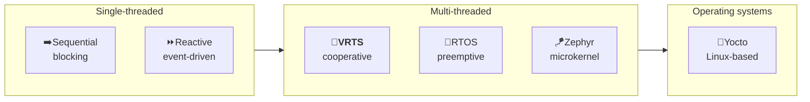

**VRTS** _(Voluntary Release Threads System)_ is a lightweight cooperative multitasking library for STM32 _(CM0+, CM4F)_ and desktop simulation _(Linux, Windows)_. Unlike RTOS, threads are never interrupted, each one decides when to hand off the CPU. This makes code easier to reason about, and lets you develop and test in a single thread, then drop into multi-threaded execution with minimal changes.

## 💡 Concepts

Embedded applications need to handle multiple tasks at once: reading sensors, communicating, controlling outputs. How you structure that has a big impact on complexity and resource use.

**Single-threaded**

- ➡️**Sequential**: blocks on every operation. Simple, but the CPU sits idle while waiting for ADC, UART, timers.
- ⏩**Reactive** (event-driven): interrupts and callbacks keep the CPU busy, but logic fragments across handlers. Libraries become tightly coupled to the application.

**Multi-threaded**

- 🔀**VRTS**: threads yield the CPU voluntarily. No preemption, predictable execution, minimal overhead. Develop and test each thread in isolation, then register them.
- 🔁**RTOS** _(FreeRTOS)_: preemptive, fixed time slices. Powerful but adds overhead, requires mutexes and careful handling of shared memory.
- 🪁**Zephyr** : full microkernel RTOS with hardware abstraction layer. Scales to complex systems, significantly larger footprint.

**Operating systems**

- 🐧**Yocto**: Linux-based, full OS stack. Requires MMU, orders of magnitude more resources. For application processors, not microcontrollers.

<table>
  <tr>
    <td width="50%"></td>
    <td width="50%"></td>
  </tr>
  <tr>
    <td width="50%" align="center">Sequential</td>
    <td width="50%" align="center">Reactive</td>
  </tr>
  <tr>
    <td width="50%"></td>
    <td width="50%"></td>
  </tr>
  <tr>
    <td width="50%" align="center">RTOS</td>
    <td width="50%" align="center"><b>VRTS</b></td>
  </tr>
</table>


```mermaid
flowchart LR
  subgraph single["Single-threaded"]
    SEQ["➡️Sequential<br>blocking"]
    REA["⏩Reactive<br>event-driven"]
  end
  subgraph multi["Multi-threaded"]
    VRT["🔀<b>VRTS</b><br>cooperative"]
    RTO["🔁RTOS<br>preemptive"]
    ZEP["🪁Zephyr<br>microkernel"]
  end
  subgraph os["Operating systems"]
    YOC["🐧Yocto<br>Linux-based"]
  end
  single-->multi
  multi-->os
```

## 🆚 Comparison

Subjective comparison of embedded programming approaches.

| Metric | Sequential | Reactive | VRTS | RTOS | 🪁 Zephyr | 🐧 Yocto |
| :----- | :---: | :---: | :---: | :---: | :---: | :---: |
| RAM & Flash footprint | 🟢🟢🟢 | 🟢🟢🟢 | 🟢🟢 | 🟡🟡 | 🟡 | 🔴 |
| Scalability | 🔴 | 🟡 | 🟡🟡 | 🟢🟢 | 🟢🟢🟢 | 🟢🟢🟢 |
| Ease of use | 🟢🟢🟢 | 🟡🟡 | 🟢🟢 | 🟡 | 🟡 | 🔴 |
| Code readability | 🟢🟢🟢 | 🟡 | 🟢🟢🟢 | 🟡🟡 | 🟢🟢 | 🟡🟡 |
| No synchronization needed | 🟢🟢🟢 | 🟢🟢🟢 | 🟢🟢 | 🟡 | 🟡 | 🟡 |
| Ecosystem & community | 🟡 | 🟢🟢 | 🔴 | 🟢🟢🟢 | 🟢🟢 | 🟢🟢🟢 |

## 🚀 Getting Started

All timing functions are based on the `systick_init` base tick. Thread switching and time tracking are tightly integrated: `delay`, `timeout`, and `tick_*` all cooperate with `let` under the hood.

### Setup

```c
// main.h: override defaults if needed
#define VRTS_THREAD_LIMIT 5
#define VRTS_SWITCHING 1
```

```c
#include "vrts.h"

stack(main_stack, 256);
stack(temp_stack, 128);
stack(adc_stack,  128);

int main(void)
{
  systick_init(10); // 10ms base tick
  thread(Main_Thread, main_stack);
  thread(Temp_Thread, temp_stack);
  thread(Adc_Thread,  adc_stack);
  vrts_init(); // does not return
}
```

### `let`

Yields the CPU to the next thread. Call it whenever your thread has nothing urgent to do.

```c
void UART_Thread(void)
{
  while(1) {
    size_t len = UART_Read(&msg);
    if(len) {
      // handle message
    }
    let(); // hand off to next thread
  }
}
```

### `delay` / `sleep`

Both wait for the specified time. `delay` yields to other threads while waiting. `sleep` blocks: no switching occurs.

```c
GPIO_Set(&gpio);
delay(1000); // 1s: other threads run
GPIO_Rst(&gpio);
```

```c
GPIO_Set(&gpio);
sleep(200); // 200ms: core is locked to this thread
GPIO_Rst(&gpio);
```

### `timeout`

Waits for a condition with a deadline. Requires a callback returning `true` when the condition is met. Returns `true` if timed out.

```c
ADC_Start(&adc);
if(timeout(50, WAIT_&ADC_IsFree, &adc)) {
  // error: measurement took too long
}
else {
  uint16_t value = ADC_Get(&adc, 3); // channel 3
}
```

### `tick_keep` + `tick_over`

Schedule a one-shot task across threads. `tick_keep` sets a deadline, `tick_over` fires once when it expires and resets.

```c
uint64_t deadline;

void Thread_1(void)
{
  if(!deadline) deadline = tick_keep(500); // arm: 500ms from now
  let();
}

void Thread_2(void)
{
  if(tick_over(&deadline)) {
    // runs once, 500ms after Thread_1 armed it
  }
  let();
}
```

### `tick_keep` + `tick_away`

Poll a deadline continuously. `tick_away` returns `true` while waiting, `false` once expired: then resets.

```c
uint64_t deadline = tick_keep(1000);

while(tick_away(&deadline)) {
  // do work while time remains
  let();
}
// time's up
```

### `tick_diff`

Measure elapsed time since a reference tick.

```c
void Thread(void)
{
  uint64_t ref = tick_keep(0); // capture now
  // ... some calculations ...
  int32_t elapsed_ms = tick_diff(ref);
}
```

### Example

Three [**LEDs blink example**](example.c) independently, each in its own thread.

## 📚 Heap

VRTS includes a deterministic heap allocator and a per-thread garbage collector: a drop-in replacement for `malloc`/`free` without the stdlib overhead. Because VRTS is cooperative, a single shared heap is safe: no thread can interrupt another mid-allocation, so no locking is needed. With RTOS this is a real problem: preemption requires either per-thread heaps _(memory overhead)_ or mutexes around every allocation _(complexity and latency)_.

Call `heap_init()` once before use:

```c
heap_init();
```

### Allocator

Standard alloc/free/realloc with block splitting and coalescing.

```c
uint8_t *buf = heap_alloc(64);
// use buf...
heap_free(buf);
```

```c
buf = heap_reloc(buf, 128); // resize: copies data if needed
```

Configure in `main.h`:

```c
#define HEAP_SIZE  8192 // total heap in bytes
#define HEAP_ALIGN 8    // allocation alignment
```

### Garbage collector

`heap_new` allocates memory tracked per-thread. `heap_clear` frees everything allocated by the current thread in one call: no manual tracking needed.

```c
void Uart_Thread(void)
{
  while(1) {
    char *line = heap_new(64);
    char *resp = heap_new(128);
    // use line, resp...
    heap_clear(); // free all at once
    let();
  }
}
```

Each thread has its own GC stack: `heap_clear` in one thread does not affect allocations made in another. The stack grows automatically in `HEAP_NEW_BLOCK`-sized steps.

```c
#define HEAP_NEW_BLOCK 16 // growth step (number of tracked pointers)
```