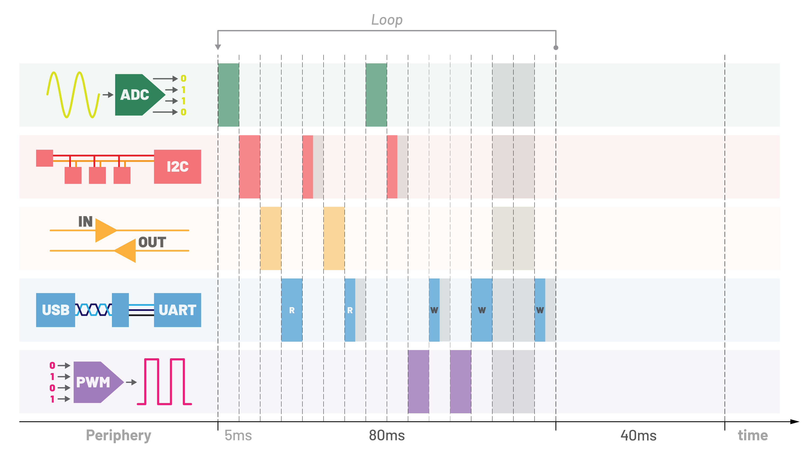
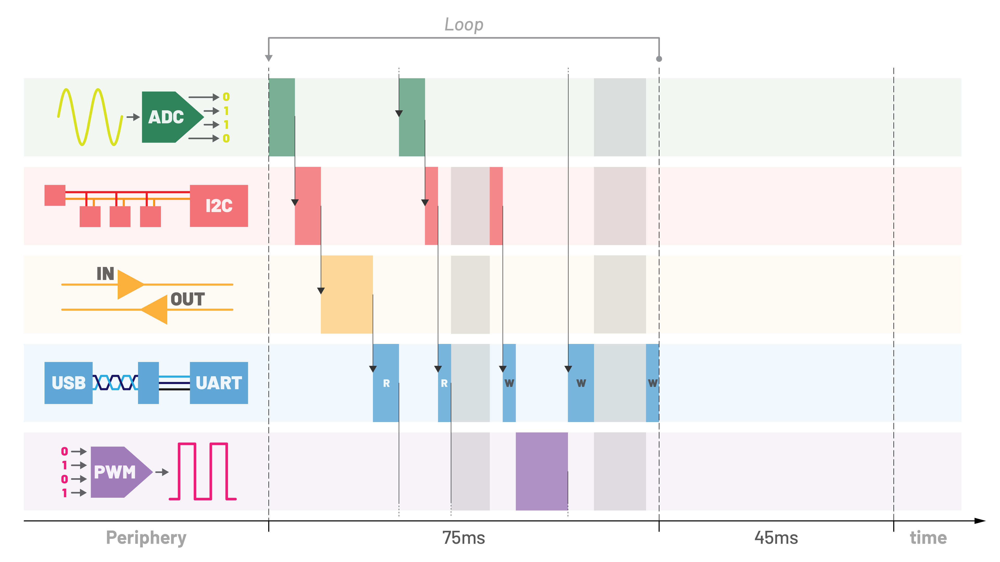

# Welcome


A Tiny library [**VRTS**](src/) _(Voluntary Release Threads System)_ using the _cooperative multitasking_ method to write multi-threaded applications as simple as possible for STM32 microcontrollers with cores M4, M3, CM0+. It can be an alternative to an **RTOS** (Real-Time Operating System), in which thread switching occurs at fixed time intervals. In [VRTS](src/) , individual threads determine when to release work, providing us with greater control over the program and resulting in safer code.

| RTOS                  | VRTS                  |
| --------------------- | --------------------- |
|  |  |

# Functions

The `thread` function allows you to add new threads

```c
SYSTICK_Init(10); // 10ms
ROOT_Init(&root);
APP_Init();
thread(&Thread_1, stack_1, sizeof(stack_1));
thread(&Thread_2, stack_2, sizeof(stack_2));
VRTS_Init();
```

The `let` function releases the core, allowing another thread to work

```c
void UART_Thread(void)
{
  while(1) {
    char *msg;
    size_t len = UART_Read(msg);
    if(len) {
      // message handling
    }
    let();
  }
}
```

The `delay` and `sleep` functions wait indicated time before moving on to the next statement. The time in `ms` is taken as an argument...

`delay` zwalnia rdzeń, pozwanalając innym wątką na pracę

```c
GPIO_Set(&gpio);
delay(1000); // 1s
GPIO_Rst(&gpio);
```

`sleep` locks the core in a thread, preventing other threads from accepting it

```c
GPIO_Set(&gpio);
sleep(200); // 200ms
GPIO_Rst(&gpio);
```

The `timeout` function specifies the maximum time to complete a certain task.
Requires a callback function that returns the free release flag. You can pass the function's data structure to the function if required

```c
ADC_Measurement(&adc); // start
uint8_t err = timeout(50, (void *)ADC_IsFree, &adc); // 50ms
if(err) {
  // message handling
}
else {
  uint16_t value = ADC_Get(&adc, 3); // channel 3
  // do job
}
```

You can combine `gettick` and `waitfor` to execute a task with a delay
This allows for delay-triggering operations between threads

```c
uint64_t todo;
void Thread_1(void)
{
  if(!todo) todo = gettick(500); // 500ms
}
void Thread_2(void)
{
   if(waitfor(&todo)) {
   // todo job
  }
}
```

It is possible to monitor the execution time of the code. To do this, use the `gettick` function in conjunction with `watch`.

```c
uint64_t stopwatch;
void Thread(void)
{
  stopwatch = gettick(0); // no-offset
  // calculations...
  uint32_t time = watch(&stopwatch) // ms
}
```

# One/multiple threads

Development work can be carried out on a single thread

```c
#define VRTS_SWITCHING 0 // inside main.h

int main(void) {
  ROOT_Init(&root);
  SYSTICK_Init(10);
  MAIN_Thread();
  // TEMP_Thread();
  // ADC_Thread();
  // FAN_Thread();
  // FUSE_Thread();
  while(1);
}
```

and eventually all threads can be transferred to the system.

```c
#define VRTS_SWITCHING 1 // inside main.h

static uint32_t main_stack[128];
static uint32_t temp_stack[128];
static uint32_t adc_stack[128];
static uint32_t fan_stack[128];
static uint32_t fuse_stack[128];

int main(void) {
  ROOT_Init(&root);
  SYSTICK_Init(10); // basetime 10ms
  thread(MAIN_Thread, main_stack, sizeof(main_stack));
  thread(TEMP_Thread, temp_stack, sizeof(temp_stack));
  thread(ADC_Thread, adc_stack, sizeof(adc_stack));
  thread(FAN_Thread, fan_stack, sizeof(fan_stack));
  thread(FUSE_Thread, fuse_stack, sizeof(fuse_stack));
  VRST_Init();
  while(1);
}
```

# Examples

In the [example](/pro/Src/main.c), a single LED blinks at a different time in each thread

```c
#include "stm32g0xx.h"
#include "vrts.h"

static void Thread_1(void);
static void Thread_2(void);
static void Thread_3(void);

static uint32_t stack_1[128];
static uint32_t stack_2[128];
static uint32_t stack_3[128];


int main(void)
{
  RCC->IOPENR |= RCC_IOPSMENR_GPIOASMEN;
  GPIOA->MODER = (GPIOA->MODER & ~(0x03 << (2 * 5))) | (0x01 << (2 * 5));
  // set PA5 as output (LED)
  SYSTICK_Init(10); // basetime 10ms
  thread(&Thread_1, stack_1, sizeof(stack_1));
  thread(&Thread_2, stack_2, sizeof(stack_2));
  thread(&Thread_3, stack_3, sizeof(stack_3));
  VRTS_Init();
  while(1);
}

static void Thread_1(void)
{
  while(1) {
    for(int i = 0; i < 8; i++) {
      GPIOA->ODR ^= (1 << 5); // PA5 toggle LED (blinking)
      sleep(250); // 4 x 250ms
    }
    let();
  }
}

static void Thread_2(void)
{
  while(1) {
    for(int i = 0; i < 14; i++) {
      GPIOA->ODR ^= (1 << 5); // PA5 toggle LED (blinking)
      sleep(100); // 7 x 100ms
    }
    let();
  }
}

static void Thread_3(void)
{
  while(1) {
    for(int i = 0; i < 4; i++) {
      GPIOA->ODR ^= (1 << 5); // PA5 toggle LED (blinking)
      sleep(500); // 2 x 500ms
    }
    let();
  }
}
```

In this example, three LEDs flash independently, each in its own thread

```c
#include "stm32g0xx.h"
#include "vrts.h"

static void Thread_1(void);
static void Thread_2(void);
static void Thread_3(void);

static uint32_t stack_1[128];
static uint32_t stack_2[128];
static uint32_t stack_3[128];

int main(void)
{
  RCC->IOPENR |= RCC_IOPSMENR_GPIOASMEN;
  GPIOA->MODER &= ~((0x03 << (2 * 5)) | (0x03 << (2 * 6)) | (0x03 << (2 * 7)));
  GPIOA->MODER |= (0x01 << (2 * 5)) | (0x01 << (2 * 6)) | (0x01 << (2 * 7));
  // set PA5, PA6, PA7 as output (LEDs)
  SYSTICK_Init(10); // basetime 10ms
  thread(&Thread_1, stack_1, sizeof(stack_1));
  thread(&Thread_2, stack_2, sizeof(stack_2));
  thread(&Thread_3, stack_3, sizeof(stack_3));
  VRTS_Init();
  while(1);
}

static void Thread_1(void)
{
  while(1) {
    for(int i = 0; i < 8; i++) {
      GPIOA->ODR ^= (1 << 5); // PA5 toggle LED (blinking)
      delay(250); // 4 x 250ms
    }
    let();
  }
}

static void Thread_2(void)
{
  while(1) {
    for(int i = 0; i < 14; i++) {
      GPIOA->ODR ^= (1 << 6); // PA6 toggle LED (blinking)
      delay(100); // 7 x 100ms
    }
    let();
  }
}

static void Thread_3(void)
{
  while(1) {
    for(int i = 0; i < 4; i++) {
      GPIOA->ODR ^= (1 << 7); // PA7 toggle LED (blinking)
      delay(500); // 2 x 500ms
    }
    let();
  }
}
```
